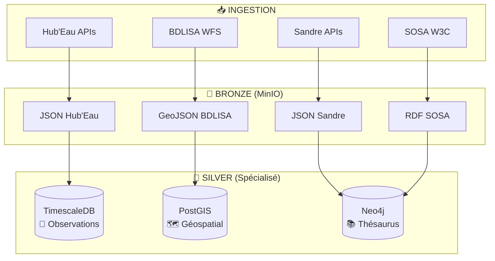
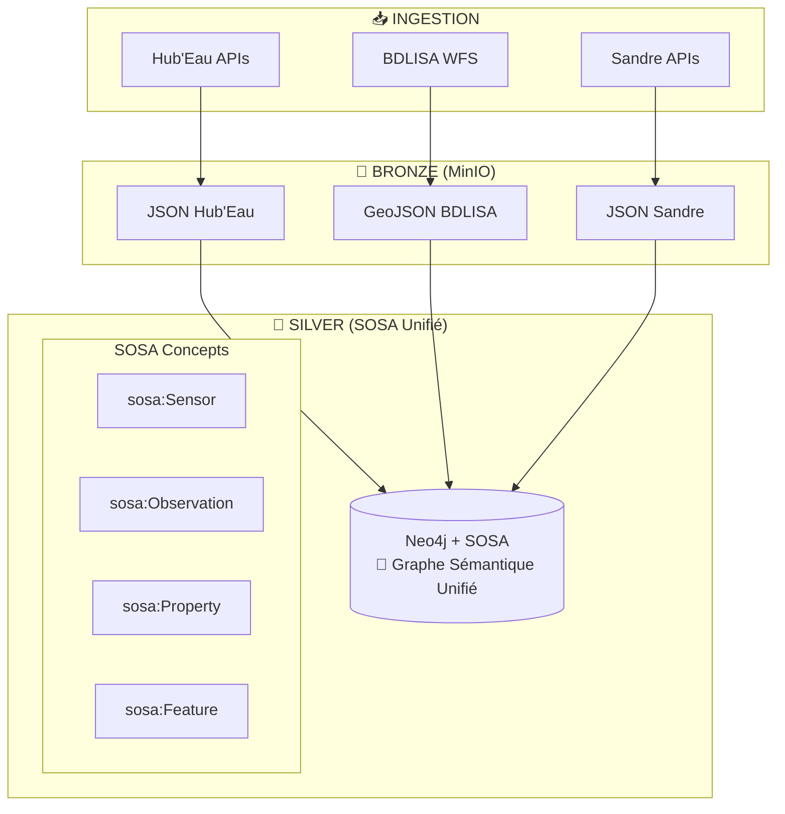
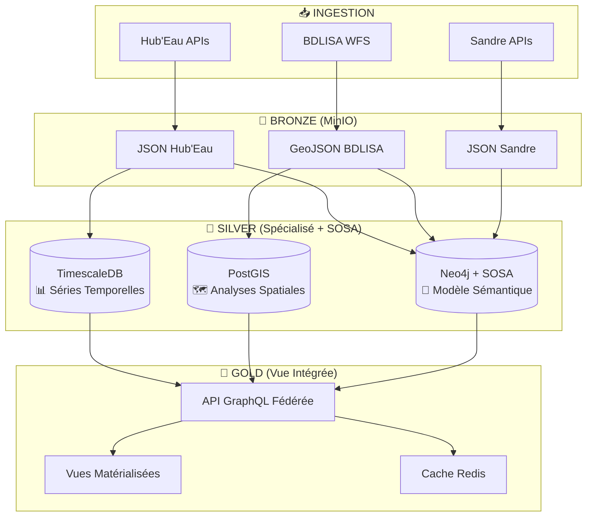

# 🎯 Stratégie d'Entreposage des Données - Analyse Comparative
## TimescaleDB vs Neo4j+SOSA vs Architecture Hybride

---

## 📊 **Situation Actuelle vs Alternatives**

### **🔄 Architecture Actuelle**


### **🔗 Alternative SOSA Centralisée**


---

## 🎯 **Analyse Comparative Détaillée**

### **1️⃣ Approche Actuelle : Bases Spécialisées**

#### **✅ Avantages**
```yaml
TimescaleDB:
  - Performance temporelle optimisée (hypertables)
  - Requêtes SQL familières
  - Compression automatique
  - Agrégations temporelles natives
  - Intégration BI/reporting facile

PostGIS:
  - Analyses spatiales performantes 
  - Index géospatiaux optimisés
  - Fonctions GIS avancées
  - Interopérabilité QGIS/ArcGIS
  - Standards OGC

Neo4j Thésaurus:
  - Requêtes de nomenclatures rapides
  - Relations sémantiques Sandre
  - Performance graphe optimisée
```

#### **❌ Inconvénients**
```yaml
Fragmentation:
  - Données éclatées sur 3 bases
  - Requêtes cross-sources complexes
  - Synchronisation manuelle
  - Pas de modèle unifié
  - Duplication métadonnées stations

Maintenance:
  - 3 bases à maintenir
  - 3 modèles de données différents
  - Complexité opérationnelle
  - Backup/restore multiple
```

### **2️⃣ Approche SOSA : Graphe Sémantique Unifié**

#### **✅ Avantages**
```yaml
Modèle_Unifié:
  - Standard W3C (interopérabilité)
  - Modèle conceptuel cohérent
  - Relations explicites entre concepts
  - Évolutivité sémantique
  - Conformité FAIR data

Flexibilité:
  - Ajout nouveaux types capteurs facile
  - Propriétés observées extensibles
  - Relations complexes natives
  - Requêtes SPARQL expressives
  - Linking open data possible

Recherche_Avancée:
  - Inférence automatique
  - Raisonnement sémantique
  - Découverte de patterns
  - Requêtes par similarité
```

#### **❌ Inconvénients**
```yaml
Performance:
  - Requêtes temporelles moins optimisées
  - Pas de compression native
  - Agrégations lourdes sur gros volumes
  - Courbe d'apprentissage SPARQL

Écosystème:
  - Outils BI moins matures
  - Intégration reporting complexe
  - Moins d'expertise équipe
  - Stack technique plus exotique
```

---

## 🏆 **Recommandation : Architecture Hybride Optimisée**

### **🎯 Stratégie "Best of Both Worlds"**



### **🔧 Rôles Spécialisés**

#### **📊 TimescaleDB - "Moteur Analytique"**
```sql
-- Optimisé pour :
-- ✅ Séries temporelles volumineuses
-- ✅ Agrégations rapides
-- ✅ Tableaux de bord temps réel
-- ✅ Alerting/monitoring
-- ✅ Exports BI/reporting

SELECT 
    station_code,
    time_bucket('1 day', timestamp) as jour,
    AVG(valeur) as moyenne_journaliere,
    MIN(valeur) as minimum,
    MAX(valeur) as maximum
FROM observations 
WHERE timestamp >= NOW() - INTERVAL '1 year'
  AND parametre_code = '1301'  -- Température
GROUP BY station_code, jour
ORDER BY jour DESC;
```

#### **🗺️ PostGIS - "Moteur Géospatial"**
```sql
-- Optimisé pour :
-- ✅ Analyses spatiales complexes
-- ✅ Intersections géométriques
-- ✅ Calculs de proximité
-- ✅ Cartes/visualisations
-- ✅ Relations territoriales

SELECT 
    s.station_code,
    s.station_name,
    f.nom_formation,
    f.type_aquifere,
    ST_Distance(s.geom, f.geometry) as distance_formation
FROM stations_geo s
JOIN formations_aquiferes f ON ST_DWithin(s.geom, f.geometry, 1000)
WHERE s.type_station = 'piezometer'
ORDER BY distance_formation;
```

#### **🔗 Neo4j+SOSA - "Moteur Sémantique"**
```cypher
// Optimisé pour :
// ✅ Relations conceptuelles
// ✅ Découverte de patterns
// ✅ Inférence sémantique  
// ✅ Métadonnées enrichies
// ✅ Linking data externe

// Stations similaires par contexte hydrogéologique + paramètres mesurés
MATCH (s1:Station)-[:LOCATED_IN]->(aq:Aquifer)<-[:LOCATED_IN]-(s2:Station)
MATCH (s1)-[:OBSERVES]->(p:Property)<-[:OBSERVES]-(s2)
MATCH (s1)-[:USES_METHOD]->(m:Method)<-[:USES_METHOD]-(s2)
WHERE s1.code = "BSS001234567"
  AND s1 <> s2
RETURN s2.code, s2.name, aq.name, 
       collect(DISTINCT p.libelle) as parametres_communs,
       collect(DISTINCT m.libelle) as methodes_communes
ORDER BY size(parametres_communs) DESC;
```

---

## 🎯 **Implémentation Recommandée**

### **Phase 1 : Enrichissement SOSA (Actuel)**
```yaml
Priorité: GARDER l'architecture actuelle + enrichir Neo4j

Actions:
  1. ✅ Maintenir TimescaleDB (performance temporelle)
  2. ✅ Maintenir PostGIS (analyses spatiales)  
  3. 🆕 Enrichir Neo4j avec modèle SOSA complet
  4. 🆕 Mapper toutes les données vers concepts SOSA
  5. 🆕 Créer liens bidirectionnels entre bases

Bénéfices:
  - Pas de régression performance
  - Ajout progressif capacités sémantiques
  - Flexibilité requêtes métier
  - Préparation interopérabilité future
```

### **Phase 2 : API Fédérée (Future)**

#### **🔗 Qu'est-ce que GraphQL ?**
GraphQL est un **langage de requête** pour APIs qui permet de :
- **Requêter précisément** les données nécessaires (pas plus, pas moins)
- **Unifier multiple sources** de données derrière une seule API
- **Typage fort** avec schéma déclaratif
- **Introspection** automatique pour documentation

#### **🎯 API Fédérée Hub'Eau**
```yaml
Concept: Une seule API → 3 bases de données

Architecture:
  - GraphQL Gateway (Apollo Federation / Hasura)
  - Routing intelligent par type de données
  - Cache Redis pour optimisation performance
  - Vues matérialisées pour requêtes fréquentes

Bénéfices:
  - Interface unique pour développeurs
  - Optimisation automatique requêtes
  - Cache intelligent multi-niveaux
  - Documentation auto-générée
```

#### **🚀 Exemple Concret**
```graphql
# UNE seule requête → 3 bases interrogées en parallèle
query StationCompleteInfo($stationId: String!) {
  station(code: $stationId) {
    # Métadonnées (Neo4j)
    name, type, installation_date
    
    # Séries temporelles (TimescaleDB)
    timeseries(period: "1M") {
      timestamp, value, parameter, quality
    }
    
    # Contexte spatial (PostGIS)  
    spatial {
      aquifer_name, formation_type
      nearby_stations(radius: 10) { code, distance }
    }
    
    # Relations sémantiques (Neo4j+SOSA)
    semantic {
      observed_properties { name, unit, sandre_code }
      similar_stations { code, similarity_score }
    }
  }
}
```

#### **⚡ Cache Redis Multi-Niveaux**
```yaml
Cache_Strategy:
  L1_Application: "Résultats GraphQL (TTL: 5min)"
  L2_Database: "Requêtes SQL/Cypher courantes (TTL: 30min)"  
  L3_Computed: "Vues matérialisées cross-sources (TTL: 24h)"
  
Invalidation:
  - Automatique sur nouvelles données
  - Patterns de cache par type requête
  - Warming préventif données populaires
```

#### **📊 Vues Matérialisées Cross-Sources**
```sql
-- Vue Redis : Synthèse station enrichie
CREATE MATERIALIZED VIEW station_enriched_summary AS
SELECT 
  s.station_code,
  s.station_name,
  s.station_type,
  
  -- Dernières observations (TimescaleDB)
  ts.last_value,
  ts.last_timestamp,
  ts.trend_7d,
  
  -- Contexte spatial (PostGIS)
  pg.aquifer_name,
  pg.formation_type,
  pg.nearby_count,
  
  -- Enrichissement sémantique (Neo4j via API)
  neo.observed_properties_count,
  neo.quality_score,
  neo.similar_stations_count

FROM stations s
LEFT JOIN timescale_summary ts ON s.station_code = ts.station_id  
LEFT JOIN postgis_context pg ON s.station_code = pg.station_id
LEFT JOIN neo4j_enrichment neo ON s.station_code = neo.sensor_code

REFRESH EVERY 1 HOUR;
```

---

**🎯 Conclusion : L'architecture hybride offre le meilleur des deux mondes - performance spécialisée + richesse sémantique avec une API unifiée future !**
