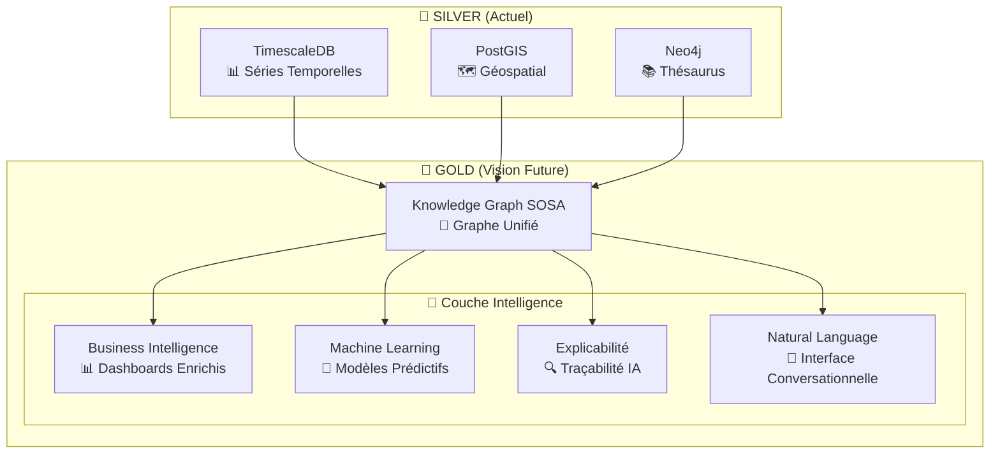

# 🔮 Vision Future : SOSA Knowledge Graph & IA
## Roadmap Évolution vers Intelligence Artificielle Hydrologiques

---

## 🎯 **Vue d'Ensemble**

Cette documentation présente la **vision future** du pipeline Hub'Eau : l'évolution vers un **Knowledge Graph intelligent** basé sur SOSA/SSN, enrichi d'**intelligence artificielle** pour révolutionner l'analyse des données hydrologiques françaises.

### **🌟 Concept Central : Knowledge Graph Hydro-Intelligent**

Le pipeline actuel (Bronze → Silver) sera enrichi d'une **couche Gold révolutionnaire** qui transformera nos données en **connaissance actionnable** via :

---

## 🔗 **1. Knowledge Graph SOSA Unifié**

### **🎯 Objectif : Hub Sémantique Central**

Le Knowledge Graph devient le **cerveau du système**, unifiant toutes les données dans un modèle sémantique W3C standard.

#### **🏗️ Architecture SOSA Enrichie**

Le modèle SOSA (Sensor, Observation, Sample, and Actuator) fournira une **couche d'abstraction sémantique** permettant de :

- **Unifier les capteurs** : Piézomètres, stations hydro, capteurs qualité sous un modèle commun
- **Standardiser les observations** : Format uniforme pour toutes les mesures
- **Enrichir les relations** : Liens intelligents entre capteurs, paramètres, contexte géologique
- **Faciliter l'interopérabilité** : Standards W3C pour échanges internationaux

#### **🔄 Synchronisation Temps Réel**

Le Knowledge Graph sera alimenté en continu par :
- **Nouvelles observations** depuis TimescaleDB
- **Enrichissements spatiaux** depuis PostGIS
- **Nomenclatures mises à jour** depuis Neo4j/Sandre
- **Calculs de corrélations** dynamiques entre stations

---

## 📊 **2. Business Intelligence Révolutionnaire**

### **🎛️ Dashboards Cross-Sources Enrichis IA**

#### **🌍 Carte Intelligente Prédictive**

Une interface géospatiale enrichie IA proposera :

**Couches Prédictives :**
- **Prédictions J+1 à J+30** pour chaque station
- **Niveaux de risque** calculés automatiquement
- **Confiance des prédictions** visualisée dynamiquement

**Couches Corrélations :**
- **Liens temps réel** entre stations corrélées
- **Propagation d'anomalies** dans le réseau
- **Clustering intelligent** par similarité comportementale

**Couches Anomalies :**
- **Détection automatique** d'observations suspectes
- **Alertes prédictives** avant problèmes critiques
- **Explications contextuelles** pour chaque anomalie

#### **📈 Analytics Prédictifs Multi-Échelles**

**Santé du Réseau :**
- Prédiction de pannes d'équipement
- Optimisation planning maintenance
- Évaluation résilience régionale

**Insights Hydrologiques :**
- Détection patterns émergents
- Alertes précoces sécheresse/crue
- Corrélations climat-hydrologie

---

## 🤖 **3. Machine Learning sur Knowledge Graph**

### **🧠 Modèles Prédictifs Avancés**

#### **🔮 État de l'Art Technologique**

**Graph Neural Networks (GNN) :**
- Spécialisés pour données relationnelles spatiales
- Apprentissage des interactions entre stations voisines
- Propagation d'information dans le réseau de capteurs

**Physics-Informed Neural Networks (PINN) :**
- Intégration des lois physiques dans l'apprentissage
- Respect des équations d'écoulement souterrain
- Prédictions physiquement plausibles

**Ensemble Methods :**
- Combinaison multiple algorithmes spécialisés
- Réduction incertitudes par consensus
- Adaptation aux spécificités hydrologiques locales

#### **🎯 Modèles Spécialisés par Domaine**

**Piézométrie :**
- Prédiction évolution niveaux nappes
- Modélisation impact prélèvements
- Optimisation réseau surveillance

**Qualité des Eaux :**
- Détection pollution émergente
- Prédiction impact événements climatiques
- Optimisation stratégies échantillonnage

**Hydrométrie :**
- Prévision crues/étiages
- Optimisation gestion réservoirs
- Planification mesures adaptation

---

## 🔍 **4. Explicabilité & Traçabilité IA**

### **🧭 Traçabilité Complète Décisions IA**

#### **🔎 Système d'Explication Automatique**

**Transparence Algorithmique :**
- Explication facteurs contributifs pour chaque prédiction
- Validation physique des résultats IA
- Traçabilité complète chaîne décisionnelle
- Identification sources incertitudes

**Contexte Hydrogéologique :**
- Enrichissement explications par connaissances métier
- Références aux formations aquifères (BDLISA)
- Utilisation nomenclatures officielles (Sandre)
- Comparaisons avec historiques régionaux

**Recommandations Expertes :**
- Suggestions d'actions basées sur prédictions
- Identification situations nécessitant expertise humaine
- Escalade automatique vers spécialistes
- Collaboration optimisée IA/humain

---

## 💬 **5. Interface Conversationnelle (Natural Language)**

### **🗣️ LLM → Requêtes : Démocratisation de l'Expertise**

#### **🤖 Assistant IA Hydrogéologue Virtuel**

**Compréhension Langage Naturel :**
- Traduction questions métier → requêtes techniques
- Reconnaissance entités hydrologiques spécialisées
- Contextualisation réponses selon expertise utilisateur

**Exemples d'Interactions :**
- *"Montrez-moi les piézomètres en baisse dans le Bassin parisien"*
- *"Quelle est la qualité de l'eau souterraine autour d'Orléans ?"*
- *"Prédisez l'évolution des nappes pour cet hiver"*

**Capacités Avancées :**
- Explications pédagogiques automatiques
- Suggestions de questions complémentaires
- Apprentissage préférences utilisateur
- Interface mobile pour terrain

---

## 🛠️ **Technologies de Rupture**

### **🚀 Stack Technologique Future**

#### **Knowledge Graph & Sémantique**
- **Neo4j Vector Search** : Recherche sémantique avancée
- **Apache Jena** : Framework RDF/SPARQL robuste
- **GraphDB** : Moteur inférence ontologique

#### **Intelligence Artificielle**
- **PyTorch Geometric** : Framework GNN spécialisé
- **TensorFlow Extended (TFX)** : Pipeline ML production
- **MLflow** : Gestion cycle de vie modèles

#### **Interface Conversationnelle**
- **LangChain/LlamaIndex** : Orchestration LLM
- **Hugging Face Transformers** : Modèles langage spécialisés
- **Streamlit/Gradio** : Interfaces utilisateur IA

#### **Performance & Scalabilité**
- **Redis Graph** : Cache graphe haute performance
- **Apache Kafka** : Streaming données temps réel
- **Kubernetes** : Orchestration microservices IA

---

## 🛣️ **Roadmap Implémentation**

### **📅 Phase 1 : Foundation KG (6-12 mois)**

**Objectifs Stratégiques :**
- Knowledge Graph SOSA complet opérationnel
- API unifiée pour consultation cross-sources
- Premiers dashboards enrichis sémantiquement

**Livrables Clés :**
- Modèle SOSA intégré dans Neo4j
- Synchronisation temps réel 3 bases
- Interface GraphQL fédérée
- Documentation utilisateur KG

### **📅 Phase 2 : Intelligence & ML (12-18 mois)**

**Objectifs Stratégiques :**
- Modèles prédictifs spécialisés opérationnels
- Détection anomalies automatisée
- Système recommandations intelligentes

**Livrables Clés :**
- Suite modèles ML hydrologiques
- Pipeline MLOps complet
- Système alertes prédictives
- Framework explicabilité

### **📅 Phase 3 : Natural Language Interface (18-24 mois)**

**Objectifs Stratégiques :**
- Interface conversationnelle grand public
- Démocratisation accès données techniques
- Assistant IA hydrogéologue virtuel

**Livrables Clés :**
- LLM fine-tuné domaine hydrologie
- Interface web/mobile conversationnelle
- Base connaissances intégrée
- Formation utilisateurs interface naturelle

---

## 🎯 **Impact Attendu & Transformation**

### **📈 Bénéfices Quantifiables**

**Efficacité Opérationnelle :**
- Réduction 70% temps analyses exploratoires
- Détection anomalies temps réel vs descriptif
- Prédictions fiables horizon 30 jours
- Automatisation 90% rapports routine

**Qualité Décisions :**
- Explications traçables 100% prédictions
- Validation physique automatique
- Recommandations contextualisées
- Réduction significative faux positifs

**Démocratisation Expertise :**
- Interface naturelle pour non-experts
- Formation réduite nouveaux utilisateurs
- Accès mobile terrain/urgences
- Collaboration IA/humain optimisée

### **🌍 Impact Sociétal & Scientifique**

**Gestion Ressources Eau :**
- Anticipation crises hydriques complexes
- Optimisation prélèvements durables
- Protection proactive nappes vulnérables
- Adaptation intelligente changement climatique

**Innovation Scientifique :**
- Standards interopérabilité européens/mondiaux
- Publications recherche IA hydro-environnementale
- Transfert technologique autres domaines géo-environnementaux
- Formation nouvelle génération experts IA+hydrologie

**Souveraineté Technologique :**
- Maîtrise française technologies IA eau
- Exportation savoir-faire international
- Leadership européen données environnementales
- Contribution objectifs développement durable

---

## 🔬 **Conclusion : Vers l'Hydrologie Augmentée**

Cette vision transforme le pipeline Hub'Eau d'un simple **intégrateur de données** vers un véritable **système d'intelligence hydro-environnementale** :

### **🌟 Révolution Paradigmatique**
- **De réactif à prédictif** : Anticipation vs constat posteriori
- **De silo à unifié** : Vision système vs fragmentation
- **De technique à accessible** : Démocratisation expertise
- **De local à global** : Interopérabilité standards mondiaux

### **🚀 Technologies de Rupture**
- **Knowledge Graph** : Unification sémantique données
- **IA Explicable** : Confiance et traçabilité décisions
- **Interface Naturelle** : Accessibilité non-experts
- **Prédiction Physique** : IA respectant lois physiques

### **🌊 Vision à Long Terme**

L'ambition finale est de créer un **écosystème d'intelligence artificielle hydrogéologique** qui :

1. **Démocratise l'expertise** technique via interfaces conversationnelles
2. **Optimise la gestion** des ressources en eau par prédiction intelligente
3. **Facilite la collaboration** internationale par standards sémantiques
4. **Accélère la recherche** via découverte automatique de patterns

**🌊 L'avenir de l'hydrologie française sera intelligent, explicable et accessible à tous !**

---

**📅 Dernière mise à jour** : Septembre 2024  
**🎯 Version** : 1.0 - Vision future Knowledge Graph & IA  
**👥 Équipe** : Innovation & Recherche Hub'Eau
