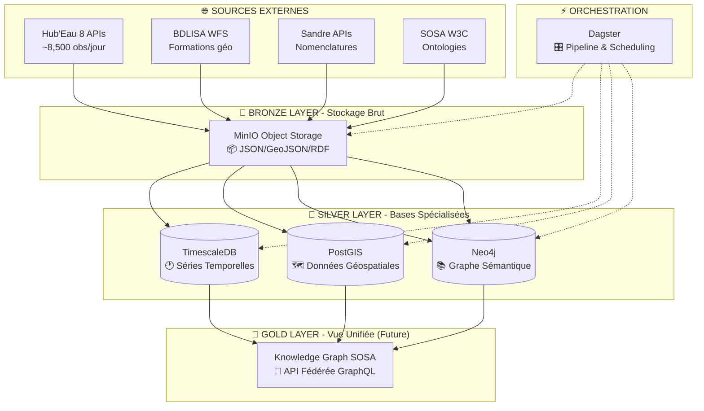

# 🏗️ Architecture Technique Hub'Eau Pipeline
## Infrastructure, Technologies & Choix Architecturaux

---

## 🎯 **Vue d'Ensemble Architecturale**

### **🔄 Architecture Medallion (Bronze → Silver → Gold)**


---

## 🛠️ **Stack Technologique**

### **🔧 Technologies Principales**

| **Couche** | **Technologie** | **Version** | **Rôle** |
|------------|----------------|-------------|----------|
| **Orchestration** | Dagster | 1.5+ | Pipeline moderne, assets, jobs |
| **Bronze Storage** | MinIO | Latest | Object Storage S3-compatible |
| **Time Series** | TimescaleDB | 2.14+ | Séries temporelles optimisées |
| **Geospatial** | PostGIS | 3.4+ | Analyses spatiales avancées |
| **Graph** | Neo4j | 5.15 | Graphe sémantique & SOSA |
| **Infrastructure** | Docker Compose | 2.20+ | Multi-container orchestration |
| **Admin DB** | pgAdmin | Latest | Interface PostgreSQL |

### **🐳 Architecture Docker**

```yaml
Services:
  dagster_webserver:     # Interface Web (port 3000)
  dagster_daemon:        # Orchestrateur background
  timescaledb:          # Base séries temporelles (port 5432)
  postgis:              # Base géospatiale (port 5433)
  neo4j:                # Base graphe (ports 7474, 7687)
  minio:                # Stockage objets (ports 9000, 9001)
  pgadmin:              # Administration DB (port 5050)

Volumes:
  - Initialisation automatique bases (SQL/Cypher scripts)
  - Persistance données
  - Configuration services
```

---

## 🎯 **Choix Architecturaux**

### **🥉 Bronze Layer : MinIO Object Storage**

**Pourquoi MinIO ?**
- **S3-Compatible** : API standard, migration cloud facile
- **Performance** : Stockage distribué haute performance
- **Simplicité** : Déploiement Docker simple
- **Formats multiples** : JSON, GeoJSON, RDF natifs

**Organisation des données :**
```
bronze/
├── hubeau/          # 8 APIs par date (JSON)
├── bdlisa/          # Données géographiques (GeoJSON)
├── sandre/          # Nomenclatures (JSON)
└── sosa/            # Ontologies (RDF)
```

### **🥈 Silver Layer : Bases Spécialisées**

#### **⏰ TimescaleDB - "Moteur Temporel"**

**Pourquoi TimescaleDB ?**
- **Hypertables** : Partitioning automatique par temps
- **Compression** : Réduction 90% stockage données anciennes
- **Performance** : Requêtes agrégées 1000x plus rapides
- **Écosystème** : Compatible PostgreSQL/BI tools

**Cas d'usage :**
- Séries temporelles Hub'Eau (observations, mesures)
- Agrégations rapides (moyennes, tendances)
- Alerting temps réel
- Exports BI/reporting

#### **🗺️ PostGIS - "Moteur Géospatial"**

**Pourquoi PostGIS ?**
- **Standards OGC** : WFS, WMS, formats GIS standard
- **Performance spatiale** : Index GIST optimisés
- **Fonctions avancées** : Analyses spatiales complexes
- **Intégration** : QGIS, ArcGIS, outils métier

**Cas d'usage :**
- Données BDLISA (formations aquifères)
- Géolocalisation stations Hub'Eau
- Relations spatiales (stations ↔ formations)
- Cartes et visualisations

#### **🔗 Neo4j - "Moteur Sémantique"**

**Pourquoi Neo4j ?**
- **Performance graphe** : Traversals complexes optimisés
- **Flexibilité** : Schéma évolutif, relations dynamiques
- **Standards W3C** : Support RDF/SPARQL (plugins)
- **Écosystème** : APOC, GDS pour analytics avancés

**Cas d'usage :**
- Thésaurus Sandre (nomenclatures)
- Modèle SOSA (capteurs, observations)
- Relations conceptuelles complexes
- Discovery patterns et corrélations

---

## 🔄 **Pipeline Dagster**

### **📦 Organisation Assets**

```
src/hubeau_pipeline/assets/
├── bronze/              # Ingestion données brutes
│   ├── hubeau_ingestion.py      # 5 APIs principales
│   ├── hubeau_complementary.py  # 3 APIs complémentaires  
│   └── external_data.py         # BDLISA + Sandre + SOSA
├── silver/              # Transformation spécialisée
│   ├── timescale_optimized.py   # Chargement TimescaleDB
│   ├── postgis_geospatial.py    # Chargement PostGIS
│   └── neo4j_semantic.py        # Chargement Neo4j
└── gold/                # Analytics & KG (Future)
    └── sosa_unified.py          # Knowledge Graph SOSA
```

### **🚀 Jobs & Scheduling**

| **Job** | **Fréquence** | **Assets** | **Objectif** |
|---------|---------------|------------|--------------|
| `hubeau_production_job` | Quotidien 6h | 5 APIs principales → TimescaleDB | Données opérationnelles |
| `hubeau_complementary_job` | Hebdomadaire | 3 APIs complémentaires | Données campagnes |
| `bdlisa_production_job` | Trimestriel | WFS → PostGIS | Référentiel géologique |
| `sandre_production_job` | Mensuel | APIs → Neo4j | Nomenclatures |

### **⚙️ Configuration Technique**

**Retry & Resilience :**
- Retry automatique (3x avec backoff exponentiel)
- Gestion erreurs réseau/API
- Timeout configurables par source

**Partitioning :**
- Daily : Assets Hub'Eau quotidiens
- Static : Référentiels (BDLISA, Sandre, SOSA)

**Performance :**
- Pagination optimisée APIs (20K records/page)
- Batch loading bases de données
- Parallel processing assets indépendants

---

## 🔄 **Intégration Cross-Sources**

### **🔗 Stratégie de Liaison**

**Référencement croisé :**
- TimescaleDB stocke IDs stations → références PostGIS/Neo4j
- Neo4j maintient liens vers données temporelles
- PostGIS connecte géographie ↔ sémantique

**Synchronisation :**
- Asset dédié pour maintenir cohérence
- Validation intégrité références
- Mise à jour automatique métadonnées

---

## 📊 **Monitoring & Observabilité**

### **🎛️ Métriques Dagster**

**Santé Pipeline :**
- Taux succès materialization assets (> 98%)
- Durée exécution jobs (< 15min)
- Fraîcheur données (< 6h pour Hub'Eau)

**Performance Bases :**
- TimescaleDB : Temps requête moyen (< 100ms)
- PostGIS : Requêtes spatiales (< 500ms)  
- Neo4j : Traversals graphe (< 200ms)

**Infrastructure :**
- Utilisation mémoire/CPU conteneurs
- Espace disque croissance
- Santé réseau inter-services

### **🚨 Alerting**

**Sensors Dagster :**
- Détection données manquantes
- Échecs répétés ingestion
- Dégradation performance
- Intégrité références croisées

---

## 🔐 **Sécurité & Gouvernance**

### **🛡️ Contrôle d'Accès**

**Bases de données :**
- Utilisateurs read-only (analystes, dashboards)
- Utilisateur service Dagster (read-write)
- Admin complet (maintenance)

**Réseau :**
- Services internes isolés
- Exposition contrôlée (reverse proxy)
- Chiffrement communications

### **📋 Gouvernance Données**

**Rétention :**
- Bronze (MinIO) : 2 ans
- Silver (bases) : 10 ans  
- Métadonnées : permanent

**Backup :**
- Sauvegarde quotidienne automatisée
- Rétention 30j local + 1 an cloud
- Tests restoration mensuels

**Compliance :**
- Données publiques (pas de RGPD)
- Licence Etalab 2.0
- Standards OpenData

---

## 🚀 **Déploiement & Maintenance**

### **📦 Setup Rapide**

```bash
# Infrastructure complète en 5 minutes
git clone <repository>
cd hubeau-pipeline
cp env.example .env
docker-compose up -d

# Vérification santé
docker-compose ps
curl localhost:3000/health
```

### **🔧 Maintenance Opérationnelle**

**Quotidien :**
- Monitoring logs Dagster
- Vérification métriques
- Contrôle espace disque

**Hebdomadaire :**
- Tests backup/restore
- Review performance
- Mise à jour sécurité

**Mensuel :**
- Optimisation index bases
- Capacity planning
- Update dépendances

---

## 📈 **Scalabilité & Évolution**

### **⚡ Optimisations Actuelles**

**TimescaleDB :**
- Hypertables avec compression automatique
- Continuous aggregates pour dashboards
- Parallel query execution

**PostGIS :**
- Index spatiaux GIST automatiques
- Clustering géographique données
- Optimisation bbox queries

**Neo4j :**
- Index propriétés fréquentes
- APOC procedures pour performance
- Cache plans d'exécution

### **🔮 Évolutions Prévues**

**Scaling Infrastructure :**
- Migration Kubernetes (production)
- Réplication bases critiques
- Load balancing services

**Nouvelles Capacités :**
- API GraphQL fédérée (Phase 2)
- Cache Redis multi-niveaux
- Stream processing temps réel

**Intelligence Artificielle :**
- Pipeline MLOps intégré
- Modèles prédictifs spécialisés
- Interface conversationnelle

---

## 🎯 **Décisions Architecturales Clés**

### **✅ Choix Validés**

**Architecture Medallion :**
- Séparation claire Bronze/Silver/Gold
- Évolutivité et maintenance
- Standards data engineering

**Bases Spécialisées :**
- Performance optimale par domaine
- Écosystème outils mature
- Expertise équipe préservée

**Orchestration Dagster :**
- Pipeline moderne et observabilité
- Asset-based vs DAG traditionnel
- Community active et évolution

### **🔄 Alternatives Écartées**

**Lakehouse unique :**
- Complexité requêtes cross-domaines
- Performance dégradée
- Courbe apprentissage équipe

**ETL traditionnel :**
- Rigidité pipeline
- Observabilité limitée
- Maintenance complexe

**Microservices pur :**
- Over-engineering phase actuelle
- Complexité opérationnelle
- Latence inter-services

---

**🎯 Architecture optimisée pour performance, maintenabilité et évolutivité vers l'IA !**

---

**📅 Dernière mise à jour** : Septembre 2024  
**🎯 Version** : 1.0 - Architecture technique optimisée  
**👥 Équipe** : Infrastructure & Data Engineering